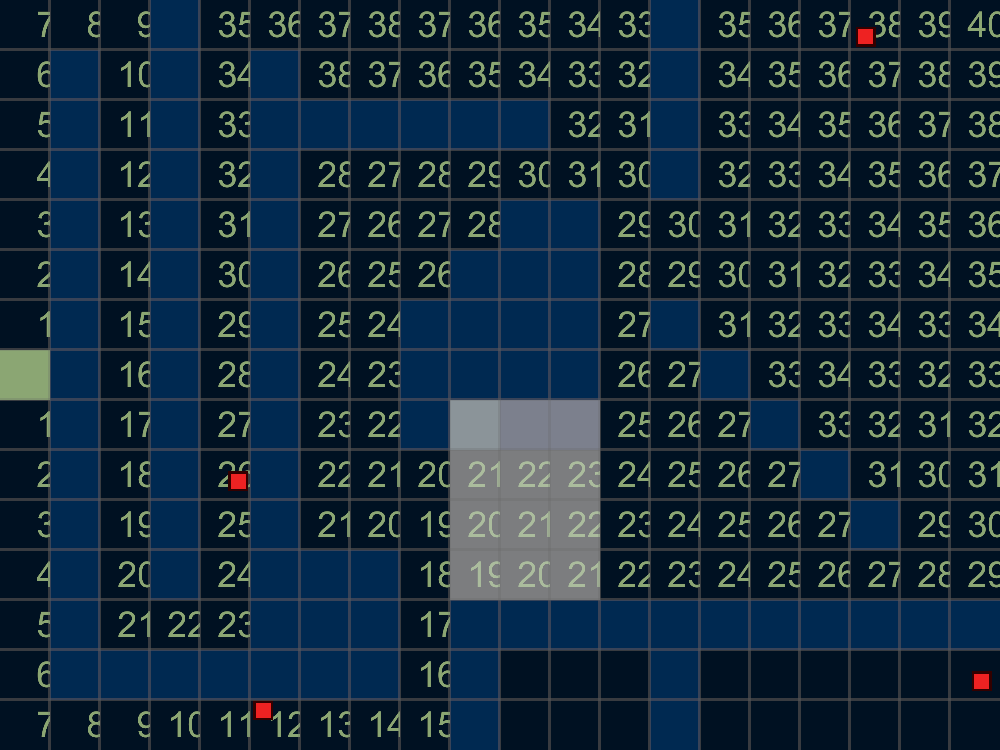

A simple pathfinding demo using the [Piston](https://piston.rs) game engine.

## Features / what the code can be used for:

* Event loop and rendering code using the latest versions of piston (*as of June 2018*), see Cargo.toml for exact versions.
* Simple pathfinding (all non-wall tiles have equal cost, no diagonal movement).
* Window resize handling with letterboxing to maintain aspect ratio.
* Simple font-based text rendering. (You might have to install `libfontconfig1-dev` on Linux)

Disclaimer: The code has gone through many cycles of update dependencies -> get errors -> fix them, and might not be idiomatic Piston code. (but then again, *what is idiomatic Piston*)

Loosely based on [snake-piston](https://github.com/xojoc/snake-piston)

Released under the GPLv3 or later, see COPYING.
